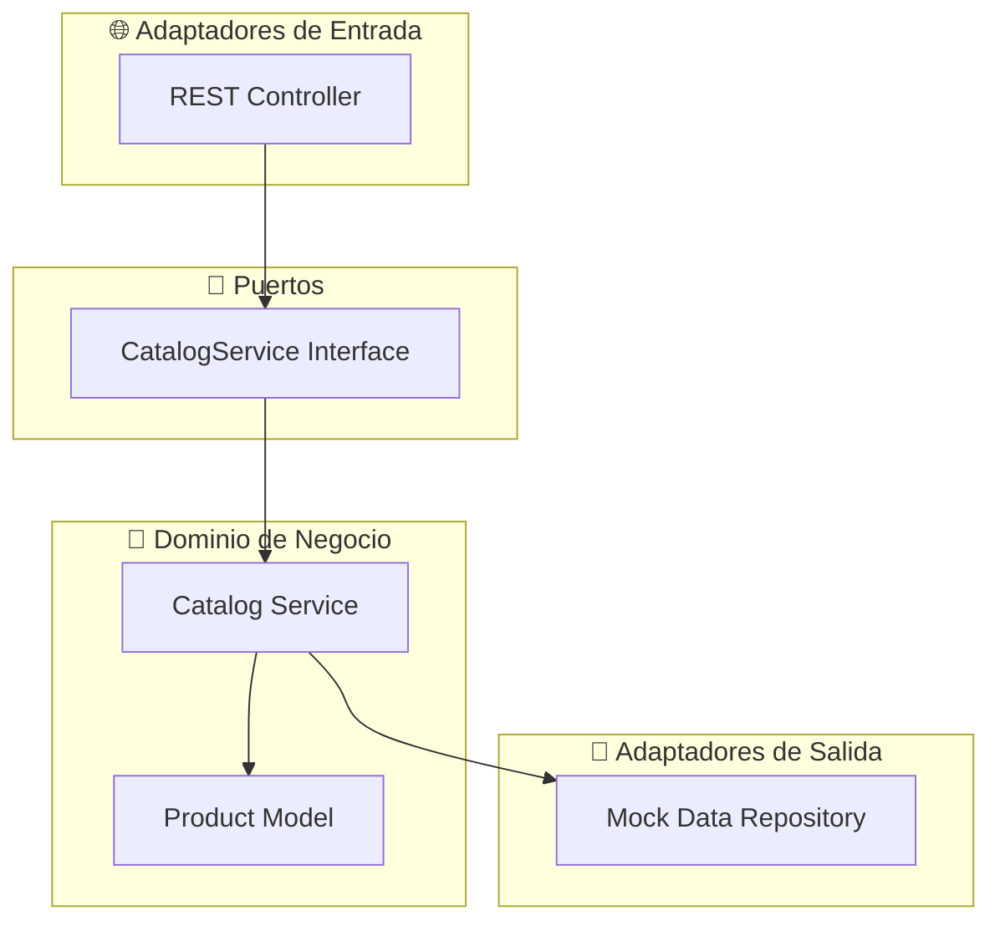

# 🛍️ Microservicio de Catálogo - TechTrend

<div align="center">


*Microservicio reactivo para gestión de catálogo de productos en la plataforma e-commerce TechTrend*

</div>

---

## 📋 Tabla de Contenidos

- [🎯 Descripción](#-descripción)
- [✨ Funcionalidades](#-funcionalidades)
- [🏗️ Arquitectura](#️-arquitectura)
- [🚀 Tecnologías](#-tecnologías)
- [📁 Estructura del Proyecto](#-estructura-del-proyecto)
- [🔌 API Endpoints](#-api-endpoints)
- [⚡ Inicio Rápido](#-inicio-rápido)
- [🧪 Pruebas](#-pruebas)
- [📊 Datos Mock](#-datos-mock)
- [🔧 Configuración](#-configuración)
- [📈 Monitoreo](#-monitoreo)
- [🤝 Contribución](#-contribución)

---

## 🎯 Descripción

El **Microservicio de Catálogo** es un componente clave de la plataforma e-commerce TechTrend, diseñado para gestionar el inventario y la información de productos de manera eficiente y escalable.

### 🎪 Caso de Uso Principal
> *"Un cliente verifica si una laptop está disponible antes de añadirla al carrito"*

### 🏢 Contexto Empresarial
TechTrend es una plataforma de e-commerce especializada en equipos informáticos que requiere:
- ✅ **Seguridad**: Manejo de datos sensibles y validaciones robustas
- ✅ **Experiencia del Usuario**: Funcionalidades confiables para compras fluidas  
- ✅ **Escalabilidad**: Soporte de tráfico de liquidaciones y ventas masivas
- ✅ **Mantenibilidad**: Arquitectura que facilite actualizaciones y regresiones

---

## ✨ Funcionalidades

| Funcionalidad | Descripción | Endpoint |
|---------------|-------------|----------|
| 📦 **Listar Productos** | Obtiene todos los productos disponibles en stock | `GET /api/catalog/products` |
| 🔍 **Buscar Producto** | Encuentra un producto específico por ID | `GET /api/catalog/products/{id}` |
| 📊 **Verificar Stock** | Valida disponibilidad para cantidad solicitada | `GET /api/catalog/products/{id}/stock` |
| 📋 **Detalles Producto** | Información completa (nombre, precio, stock) | `GET /api/catalog/products/{id}/details` |

### 🎯 Requisitos Empresariales Cubiertos
- ✅ Inventarios precisos y actualizados
- ✅ Prevención de compras de productos agotados
- ✅ Experiencia de usuario mejorada
- ✅ Integración con otros microservicios (Carrito, Pagos)

---

## 🏗️ Arquitectura

### Arquitectura Hexagonal (Ports & Adapters)



### 🔄 Flujo Reactivo
```
Cliente → Controller → Service → Mono/Flux → Respuesta JSON
```

---

## 🚀 Tecnologías

### Core Stack
- **☕ Java 17** - LTS con características modernas
- **🍃 Spring Boot 3.2.0** - Framework de aplicación
- **⚡ Spring WebFlux** - Programación reactiva no-bloqueante
- **🔧 Maven** - Gestión de dependencias y build

### Testing Stack
- **🧪 JUnit 5** - Framework de pruebas unitarias
- **🎭 Mockito** - Mocking y stubbing
- **🔬 Reactor Test** - Testing para streams reactivos
- **🌐 WebTestClient** - Testing de endpoints REST

### Dependencias Clave
```xml
<dependencies>
    <dependency>
        <groupId>org.springframework.boot</groupId>
        <artifactId>spring-boot-starter-webflux</artifactId>
    </dependency>
    <dependency>
        <groupId>org.springframework.boot</groupId>
        <artifactId>spring-boot-starter-validation</artifactId>
    </dependency>
</dependencies>
```

---

## 📁 Estructura del Proyecto

```
📦 catalog-microservice/
├── 📄 pom.xml                          # Configuración Maven
├── 📖 README.md                        # Documentación
├── 📂 src/
│   ├── 📂 main/
│   │   ├── 📂 java/com/techtrend/catalog/
│   │   │   ├── 📂 model/
│   │   │   │   └── 📄 Product.java      # 🏷️ Entidad de dominio
│   │   │   ├── 📂 service/
│   │   │   │   ├── 📄 CatalogService.java     # 🔌 Puerto (Interface)
│   │   │   │   └── 📄 CatalogServiceImpl.java # 💼 Lógica de negocio
│   │   │   ├── 📂 controller/
│   │   │   │   └── 📄 CatalogController.java  # 🌐 REST Endpoints
│   │   │   └── 📄 CatalogMicroserviceApplication.java # 🚀 Main
│   │   └── 📂 resources/
│   │       └── 📄 application.yml       # ⚙️ Configuración
│   └── 📂 test/
│       └── 📂 java/com/techtrend/catalog/
│           ├── 📄 ProductTest.java              # 🧪 Tests entidad
│           ├── 📄 CatalogServiceTest.java       # 🧪 Tests servicio  
│           ├── 📄 CatalogControllerTest.java    # 🧪 Tests controller
│           └── 📄 CatalogMicroserviceApplicationTest.java # 🧪 Tests integración
```

---

## 🔌 API Endpoints

### 📦 Listar Productos Disponibles
```http
GET /api/catalog/products
Accept: application/json
```

**Respuesta Exitosa (200):**
```json
[
  {
    "id": "1",
    "name": "Laptop Ryzen 7",
    "price": 9999.99,
    "quantity": 50,
    "available": true
  }
]
```

### 🔍 Obtener Producto por ID
```http
GET /api/catalog/products/{id}
Accept: application/json
```

**Respuesta Exitosa (200):**
```json
{
  "id": "1",
  "name": "Laptop Ryzen 7", 
  "price": 9999.99,
  "quantity": 50,
  "available": true
}
```

**Producto No Encontrado (404):**
```json
{
  "timestamp": "2025-08-16T22:00:00Z",
  "status": 404,
  "error": "Not Found"
}
```

### 📊 Verificar Stock
```http
GET /api/catalog/products/{id}/stock?quantity={cantidad}
Accept: application/json
```

**Parámetros:**
- `quantity` (required): Cantidad solicitada (entero positivo)

**Respuesta Exitosa (200):**
```json
true  // Stock suficiente
```

**Cantidad Inválida (400):**
```json
{
  "error": "La cantidad debe ser mayor a 0"
}
```

### 📋 Obtener Detalles del Producto
```http
GET /api/catalog/products/{id}/details
Accept: application/json
```

**Respuesta:** Igual que obtener producto por ID

---

## ⚡ Inicio Rápido

### 📋 Prerrequisitos
- ☕ **Java 17+** ([Descargar](https://adoptium.net/))
- 🔧 **Maven 3.6+** ([Descargar](https://maven.apache.org/download.cgi))
- 🌐 **curl** o **Postman** (para testing)

### 🚀 Instalación y Ejecución

```bash
# 1️⃣ Clonar el repositorio
git clone <repository-url>
cd catalog-microservice

# 2️⃣ Compilar el proyecto
mvn clean compile

# 3️⃣ Ejecutar pruebas
mvn test

# 4️⃣ Iniciar la aplicación
mvn spring-boot:run
```

### 🧪 Verificar Funcionamiento

```bash
# Listar todos los productos disponibles
curl http://localhost:8080/api/catalog/products

# Obtener producto específico
curl http://localhost:8080/api/catalog/products/1

# Verificar stock (10 unidades de producto 1)
curl "http://localhost:8080/api/catalog/products/1/stock?quantity=10"

# Obtener detalles completos
curl http://localhost:8080/api/catalog/products/1/details
```

### 📊 Respuesta Esperada
```json
[
  {
    "id": "1",
    "name": "Laptop Ryzen 7",
    "price": 9999.99,
    "quantity": 50,
    "available": true
  },
  // ... más productos
]
```

---

## 🧪 Pruebas

### 📈 Cobertura de Pruebas
- **21 pruebas unitarias** ✅
- **4 clases de test** 📝
- **Cobertura completa** de casos de uso 🎯

### 🏗️ Estructura de Testing

| Clase de Test | Propósito | Cantidad | Tipo |
|---------------|-----------|----------|------|
| `ProductTest` | Lógica de entidad | 4 | Unitaria |
| `CatalogServiceTest` | Lógica de negocio | 8 | Unitaria |
| `CatalogControllerTest` | Endpoints REST | 8 | Integración |
| `CatalogMicroserviceApplicationTest` | Contexto Spring | 1 | Integración |

### 🎯 Escenarios de Prueba Críticos

#### ✅ Verificación de Stock
```java
// ✅ Stock suficiente → true
checkStock("1", 10) → true  // 10 pedidas, 50 disponibles

// ❌ Stock insuficiente → false  
checkStock("1", 60) → false // 60 pedidas, 50 disponibles

// 🚫 Cantidad inválida → Exception
checkStock("1", -1) → IllegalArgumentException

// 🔍 Producto inexistente → false
checkStock("999", 1) → false
```

#### 📦 Listado de Productos
```java
// Solo productos con stock > 0
getAllProducts() → 13 productos (de 15 totales)
```

### 🏃‍♂️ Ejecutar Pruebas

```bash
# Todas las pruebas
mvn test

# Pruebas específicas
mvn test -Dtest=CatalogServiceTest

# Con reporte de cobertura
mvn test jacoco:report

# Modo verbose
mvn test -X
```

### 📊 Reporte de Resultados
```
[INFO] Tests run: 21, Failures: 0, Errors: 0, Skipped: 0
[INFO] BUILD SUCCESS
```

---

## 📊 Datos Mock

### 🛍️ Catálogo de Productos (15 items)

| ID | Producto | Precio | Stock | Estado |
|----|----------|--------|-------|--------|
| 1 | Laptop Ryzen 7 | $9,999.99 | 50 | ✅ Disponible |
| 2 | Mouse Gaming | $299.99 | 100 | ✅ Disponible |
| 3 | Teclado Mecánico | $599.99 | 25 | ✅ Disponible |
| 4 | Monitor 4K | $1,299.99 | 15 | ✅ Disponible |
| 5 | Auriculares Bluetooth | $199.99 | 0 | ❌ Agotado |
| 6 | Webcam HD | $149.99 | 75 | ✅ Disponible |
| 7 | SSD 1TB | $899.99 | 30 | ✅ Disponible |
| 8 | RAM 16GB DDR4 | $449.99 | 60 | ✅ Disponible |
| 9 | Tarjeta Gráfica RTX 4060 | $3,499.99 | 8 | ⚠️ Stock Bajo |
| 10 | Procesador Intel i7 | $2,199.99 | 20 | ✅ Disponible |
| 11 | Motherboard Gaming | $1,599.99 | 12 | ✅ Disponible |
| 12 | Fuente de Poder 750W | $799.99 | 35 | ✅ Disponible |
| 13 | Case Gaming RGB | $699.99 | 18 | ✅ Disponible |
| 14 | Cooler CPU Líquido | $999.99 | 22 | ✅ Disponible |
| 15 | Tablet Android 10" | $1,899.99 | 0 | ❌ Agotado |

### 📈 Estadísticas del Inventario
- **Total productos**: 15
- **Disponibles**: 13 (86.7%)
- **Agotados**: 2 (13.3%)
- **Stock total**: 470 unidades
- **Valor inventario**: ~$15,000,000

---

## 🔧 Configuración

### ⚙️ application.yml
```yaml
server:
  port: 8080

spring:
  application:
    name: catalog-microservice
  
logging:
  level:
    com.techtrend.catalog: DEBUG
    reactor.netty: INFO
  pattern:
    console: "%d{yyyy-MM-dd HH:mm:ss} - %msg%n"

management:
  endpoints:
    web:
      exposure:
        include: health,info
  endpoint:
    health:
      show-details: always
```

### 🌍 Perfiles de Entorno

```bash
# Desarrollo
mvn spring-boot:run -Dspring.profiles.active=dev

# Producción  
mvn spring-boot:run -Dspring.profiles.active=prod

# Testing
mvn test -Dspring.profiles.active=test
```

---

## 📈 Monitoreo

### 🏥 Health Check
```bash
curl http://localhost:8080/actuator/health
```

**Respuesta:**
```json
{
  "status": "UP",
  "components": {
    "diskSpace": {"status": "UP"},
    "ping": {"status": "UP"}
  }
}
```

### 📊 Métricas
```bash
curl http://localhost:8080/actuator/info
```

### 🔍 Logs
```bash
# Ver logs en tiempo real
tail -f logs/catalog-microservice.log

# Filtrar errores
grep "ERROR" logs/catalog-microservice.log
```

---

## 🤝 Contribución

### 🔄 Flujo de Desarrollo
1. **Fork** del repositorio
2. **Crear** rama feature (`git checkout -b feature/nueva-funcionalidad`)
3. **Commit** cambios (`git commit -am 'Agregar nueva funcionalidad'`)
4. **Push** a la rama (`git push origin feature/nueva-funcionalidad`)
5. **Crear** Pull Request

### 📝 Estándares de Código
- ✅ Seguir convenciones de Java
- ✅ Documentar métodos públicos
- ✅ Escribir pruebas para nueva funcionalidad
- ✅ Mantener cobertura de pruebas > 80%

### 🧪 Antes de Enviar PR
```bash
# Ejecutar todas las pruebas
mvn clean test

# Verificar estilo de código
mvn checkstyle:check

# Compilar sin errores
mvn clean compile
```

---

## 📚 Recursos Adicionales

### 📖 Documentación
- [Spring WebFlux Reference](https://docs.spring.io/spring-framework/docs/current/reference/html/web-reactive.html)
- [Reactor Core Documentation](https://projectreactor.io/docs/core/release/reference/)
- [JUnit 5 User Guide](https://junit.org/junit5/docs/current/user-guide/)

### 🏗️ Arquitectura
- [Hexagonal Architecture](https://alistair.cockburn.us/hexagonal-architecture/)
- [Microservices Patterns](https://microservices.io/patterns/)

---

## 👨‍💻 Autor

**Desarrollado para TechTrend E-commerce Platform**

### 📝 Commits de Identificación
- `feat: implementación inicial del microservicio de catálogo`
- `test: pruebas unitarias con cobertura completa de escenarios`
- `config: configuración de Spring Boot WebFlux reactivo`
- `docs: documentación y estructura de proyecto`
- `data: ampliación de datos mock a 15 productos`

---

<div align="center">

**🚀 ¡Listo para producción! 🚀**

*Microservicio de Catálogo TechTrend - Versión 1.0.0*

</div>
